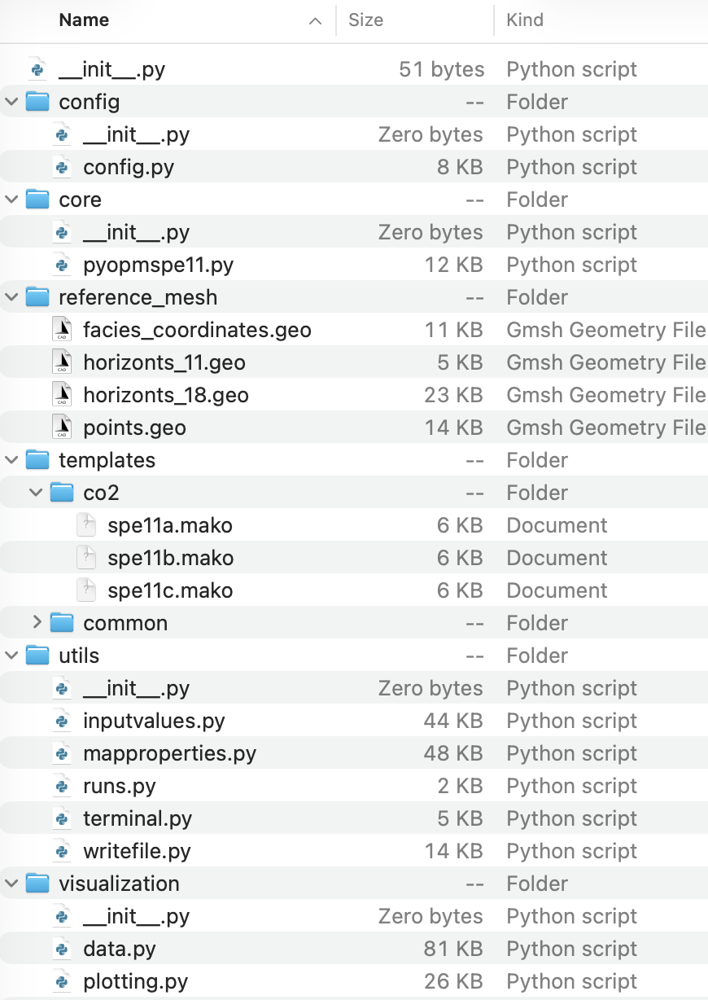

.. _api-reference:

Python API
==========

The Python API documents the public modules, classes, and functions provided by
**pyopmspe11**.

Package structure
-----------------

   Main directories and files in the pyopmspe11 package.

``core``
   Coordinates the command-line workflow, validates command-line arguments,
   and dispatches deck generation, simulation, data processing, plotting, and
   comparison operations.

``config``
   Defines the shared configuration and runtime data structures used across
   the package.

``utils``
   Reads and validates TOML and legacy TXT configurations, generates geological
   models and OPM Flow input, runs simulations, and processes benchmark data.

``reference_mesh``
   Contains Gmsh source files used to define facies boundaries and generate
   corner-point grids with 11 or 18 geological levels.

``templates``
   Contains templates used to write OPM Flow decks and supporting input files.

``visualization``
   Creates benchmark figures, spatial maps, performance plots, and comparisons
   between simulation results.

Use the :doc:`command-line` for CLI syntax and validation rules, and the
:doc:`configuration_file` for supported TOML variables.

API documentation
-----------------

.. toctree::
   :maxdepth: 2

   api/modules
