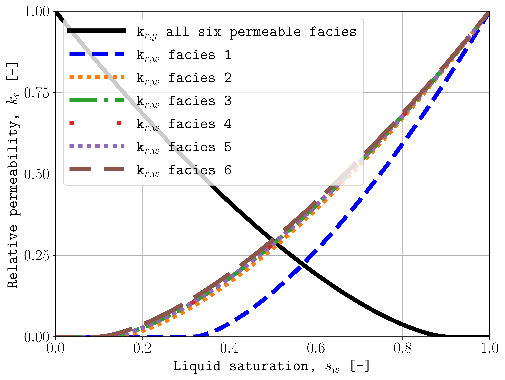
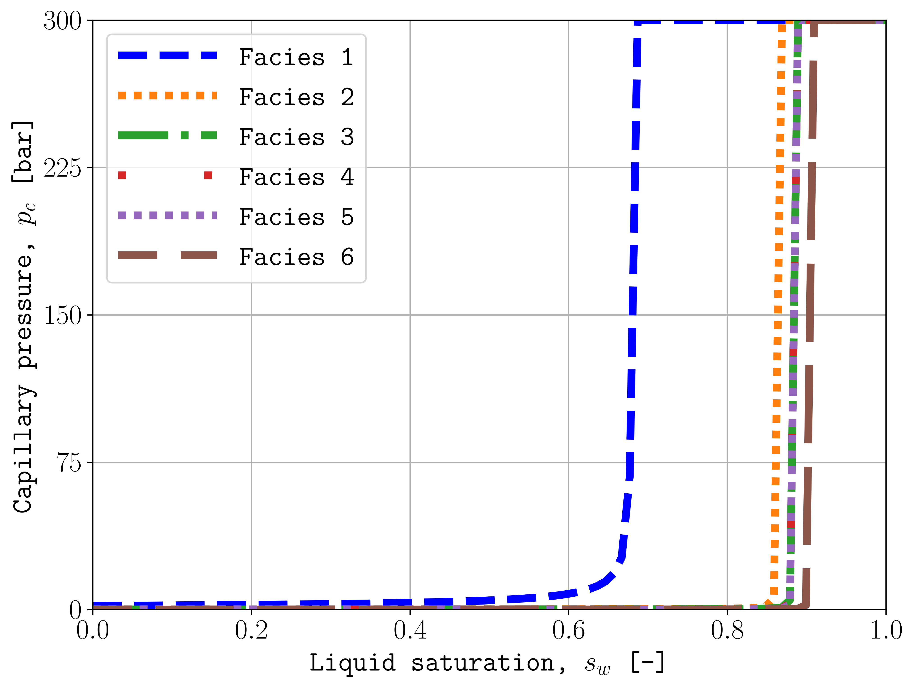

.. _configuration-rock-fluid:

Rock and fluid properties
=========================

Define permeability, porosity, thermal properties, dispersion, and saturation
functions for the seven facies. Facies 1 through 6 are permeable sands; facies
7 represents the sealing unit.

Rock properties
---------------

.. _config-rock:

rock
----

**Type:** matrix with seven rows and two columns

Each row defines one facies as ``[permeability, porosity]``. Permeability is in
mD and porosity is dimensionless. Rows correspond to facies 1 through 7.

.. code-block:: toml

   # Columns: 1) permeability [mD], 2) porosity [-]
   rock = [
       [0.10132, 0.10], # Facies 1
       [101.324, 0.20], # Facies 2
       [202.650, 0.20], # Facies 3
       [506.625, 0.20], # Facies 4
       [1013.25, 0.25], # Facies 5
       [2026.50, 0.35], # Facies 6
       [1e-5,    1e-6], # Facies 7
   ]

.. _config-kz-mult:

kzMult
------

**Type:** non-negative number

Sets the multiplier applied to permeability in the z direction.

.. code-block:: toml

   kzMult = 0.1

.. _config-rock-extra:

rockExtra
---------

**Type:** array of two positive numbers

**Applies to:** SPE11B and SPE11C

Sets rock specific heat capacity in kJ/(kg K) and rock density in kg/m3.

.. code-block:: toml

   # 1) specific heat capacity [kJ/(kg K)], 2) density [kg/m3]
   rockExtra = [0.85, 2500.0]

.. _config-rock-cond:

rockCond
--------

**Type:** array with seven non-negative numbers

**Units:** W/(m K)

Sets thermal conductivity for facies 1 through 7.

.. code-block:: toml

   rockCond = [1.9, 1.25, 1.25, 1.25, 0.92, 0.26, 2.0]

.. _config-dispersion:

dispersion
----------

**Type:** array with seven non-negative numbers

**Units:** m

Sets dispersivity for facies 1 through 7.

.. code-block:: toml

   dispersion = [10, 10, 10, 10, 10, 10, 0]

Saturation functions
--------------------

The function variables contain validated Python expressions. They are
evaluated using ``s_w`` and the facies properties in ``safu``.

.. _config-krw:

krw
---

Defines wetting-phase relative permeability.

.. code-block:: toml

   krw = "(max(0, (s_w - swi) / (1 - swi))) ** 1.5"

.. _config-krn:

krn
---

Defines non-wetting-phase relative permeability.

.. code-block:: toml

   krn = "(max(0, (1 - s_w - sni) / (1 - sni))) ** 1.5"

.. _config-pcap:

pcap
----

Defines capillary pressure in Pa.

.. code-block:: toml

   pcap = "penmax * math.erf(pen * ((s_w-swi) / (1.-swi)) ** (-(1.0 / 1.5)) * math.pi**0.5 / (penmax * 2))"

.. _config-s-w:

s_w
---

Defines the wetting-saturation points used to tabulate the functions.

.. code-block:: toml

   s_w = "(np.exp(np.flip(np.linspace(0, 5.0, npoints))) - 1) / (np.exp(5.0) - 1)"

.. _config-safu:

safu
----

**Type:** matrix with seven rows and five columns

Each row defines one facies:

1. ``swi``: irreducible wetting saturation, dimensionless.
2. ``sni``: residual non-wetting saturation, dimensionless.
3. ``pen``: capillary entry pressure, Pa.
4. ``penmax``: maximum capillary pressure, Pa.
5. ``npoints``: number of tabulated points.

.. code-block:: toml

   # Columns: 1) swi [-], 2) sni [-], 3) pen [Pa],
   #          4) penmax [Pa], 5) npoints [-]
   safu = [
       [0.32, 0.1, 193531.39, 3e7, 1000], # Facies 1
       [0.14, 0.1,   8654.99, 3e7, 1000], # Facies 2
       [0.12, 0.1,   6120.00, 3e7, 1000], # Facies 3
       [0.12, 0.1,   3870.63, 3e7, 1000], # Facies 4
       [0.12, 0.1,   3060.00, 3e7, 1000], # Facies 5
       [0.10, 0.1,   2560.18, 3e7, 1000], # Facies 6
       [0,      0,         0, 3e7,    2], # Facies 7
   ]

Visualize the saturation functions
----------------------------------

The following figures compare the relative-permeability and capillary-pressure
functions for all six permeable facies. Facies 7 is omitted because it
represents the sealing unit.

   Wetting- and non-wetting-phase relative permeability for facies 1 through 6.

   Capillary pressure for facies 1 through 6.

Generate the figures with plopm
+++++++++++++++++++++++++++++++

Run the commands from a directory containing the generated ``SPE11C`` OPM Flow
input files. The same color identifies each facies in both figures.

Relative permeability
~~~~~~~~~~~~~~~~~~~~~

Plot the non-wetting and wetting curves for facies 1 through 6.

.. code-block:: console

   plopm -i SPE11C -x '[0,1]' -lw 5 -fz 18 -fs 8,6 -yl 'Capillary pressure, $p_c$ [bar]' -xl 'Liquid saturation, $s_w$ [-]' -xnt 6 -v pcwg1,pcwg2,pcwg3,pcwg4,pcwg5,pcwg6 -y '[0,300]' -llb 'Facies 1  Facies 2  Facies 3  Facies 4  Facies 5  Facies 6' -c b,#ff7f0e,#2ca02c,#d62728,#9467bd,#8c564b -ls '--,(0, (1, 1)),-.,(0, (1, 10)),(0, (1, 1)),(5, (10, 3)),(0, (5, 10))'

Capillary pressure
~~~~~~~~~~~~~~~~~~

Plot the gas-water capillary-pressure curves for facies 1 through 6:

.. code-block:: console

   plopm -i SPE11C -x '[0,1]' -lw 5 -fz 18 -fs 8,6 -yl 'Capillary pressure, $p_c$ [bar]' -xl 'Liquid saturation, $s_w$ [-]' -xnt 6 -v pcwg1,pcwg2,pcwg3,pcwg4,pcwg5,pcwg6 -y '[0,300]' -llb 'Facies 1  Facies 2  Facies 3  Facies 4  Facies 5  Facies 6' -c b,#ff7f0e,#2ca02c,#d62728,#9467bd,#8c564b -ls '--,(0, (1, 1)),-.,(0, (1, 10)),(0, (1, 1)),(5, (10, 3)),(0, (5, 10))'

See the `plopm documentation <https://cssr-tools.github.io/plopm/>`_ for the
complete saturation-function and styling options.
   