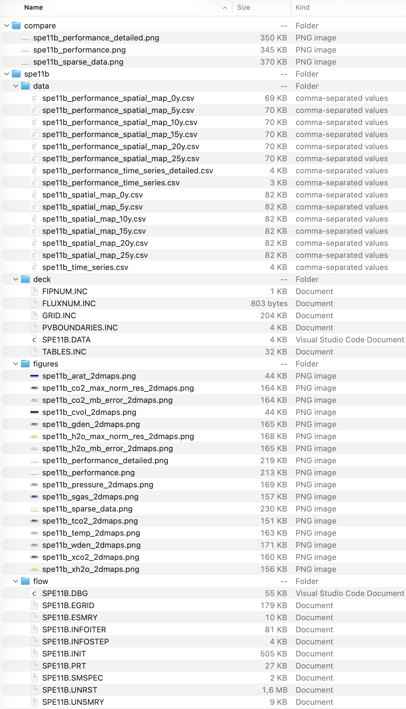

.. _output-folder:

Output folder
=============

The selected output folder contains generated decks, simulation results,
benchmark data, and figures.

   The ``spe11b`` output folder and ``compare`` folder generated by the
   :doc:`Hello world example <examples/hello-world>`.

With :option:`pyopmspe11 -f` set to ``1``, files are organized as follows:

``deck``
   Generated OPM Flow input files.

``flow``
   OPM Flow simulation results. Use `ResInsight <https://resinsight.org/>`_ or
   `plopm <https://github.com/cssr-tools/plopm>`_ for visualization.

``data``
   Dense, sparse, performance, and spatial-performance CSV files in benchmark
   format.

``figures``
   PNG figures for quick inspection and comparison.

The folders that are created depend on :option:`pyopmspe11 -m`. Set
:option:`pyopmspe11 -f` to ``0`` to write generated files directly in the
selected output folder instead.

Generated OPM Flow files can be modified before rerunning the simulation, for
example to add tracers, salinity, or rock compressibility. See the `OPM Flow
manual <https://opm-project.org/?page_id=955>`_.

.. tip::

   After installing ``dev-requirements.txt``, run the complete test suite to
   inspect outputs generated with different configurations and command-line
   options:

   .. code-block:: console

      pytest --cov=pyopmspe11 --cov-report term-missing tests/ -n auto
