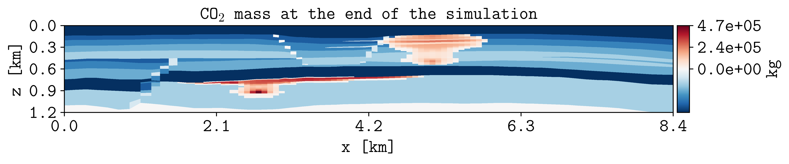

.. _tutorial-benchmark-plots:

Create benchmark plots
======================

Create the standard **pyopmspe11** figures from the benchmark CSV files
written in the previous lesson.

Command
-------

Use the same generation, reporting-grid, map-time, and write-interval settings
used for the data workflow:

.. code-block:: console

   pyopmspe11 -i my_spe11b.toml -o my_spe11b -m plot -g all -r 50,1,15 -t 5 -w 1

How it works
------------

:option:`pyopmspe11 -m`
   Selects the workflow. ``plot`` reads existing benchmark CSV files and
   creates the standard figures without regenerating the deck, rerunning OPM
   Flow, or rewriting the data.

:option:`pyopmspe11 -g`
   Selects the data categories represented in the generated figures. Use the
   same value used when the CSV files were created.

:option:`pyopmspe11 -r`, :option:`pyopmspe11 -t`, and :option:`pyopmspe11 -w`
   Keep the plotting configuration consistent with the reporting grid, spatial
   map times, and data intervals from the previous lesson.

Result
------

.. figure:: ../figs/spe11b_tco2_2Dmaps.png
   :alt: SPE11B total CO2 mass on the reporting grid
   :align: center

   CO2 mass mapped from the simulation grid to a 50 by 15 reporting grid (available at my_spe11b/figures/spe11b_tco2_2Dmaps.png).

With subfolders enabled, simulation output is written under:

.. code-block:: text

   my_spe11b/
   └── deck
   └── flow
   └── data
   └── figures/
       ├── spe11b_arat_2dmaps.png
       ├── spe11b_co2_max_norm_res_2dmaps.png
       ├── spe11b_co2_mb_error_2dmaps.png
       ├── spe11b_cvol_2dmaps.png
       ├── spe11b_gden_2dmaps.png
       ├── spe11b_h2o_max_norm_res_2dmaps.png
       ├── spe11b_h2o_mb_error_2dmaps.png
       ├── spe11b_performance_detailed.png
       ├── spe11b_performance.png
       ├── spe11b_pressure_2dmaps.png
       ├── spe11b_sgas_2dmaps.png
       ├── spe11b_sparse_data.png
       ├── spe11b_tco2_2dmaps.png
       ├── spe11b_temp_2dmaps.png
       ├── spe11b_wden_2dmaps.png
       ├── spe11b_xco2_2dmaps.png
       ├── spe11b_xh2o_2dmaps.png

Customize figures with plopm
----------------------------

The built-in plotting workflow creates standard figures. Use
`plopm <https://github.com/cssr-tools/plopm>`_ when you need additional control
over quantities, CSV columns, layouts, labels, colormaps, line styles, axis
formatting, animations, or comparisons with OPM Flow output.

Install plopm with:

.. code-block:: console

   pip install git+https://github.com/cssr-tools/plopm.git

Create a nice figure:

.. code-block:: console

   plopm -i my_spe11b/flow/MY_SPE11B -v co2m -cbn 3 -cbf .1e -t 'CO$_2$ mass at the end of the simulation' -mv satnum -mt 1e4 -cbl 'kg' -c RdBu_r -yu km -xu km -xf .1f -yf .1f -fs 10,8 -fz 16

   CO2 mass at the end of the simulation (figure created by plopm)

See the `plopm documentation <https://cssr-tools.github.io/plopm/>`_ for
complete examples and command-line options.

Run the complete workflow
-------------------------

Lessons 1 through 4 can be run in one command with ``-m all``:

.. code-block:: console

   pyopmspe11 -i my_spe11b.toml -o my_spe11b -m all -g all -r 50,1,15 -t 5 -w 1

This generates the deck, runs OPM Flow, writes the benchmark CSV files, and
creates the standard plots.

Next
----

Continue with :doc:`modify-model`. See :doc:`../output_folder` for the output
layout and :doc:`../examples` for additional visualization workflows.
